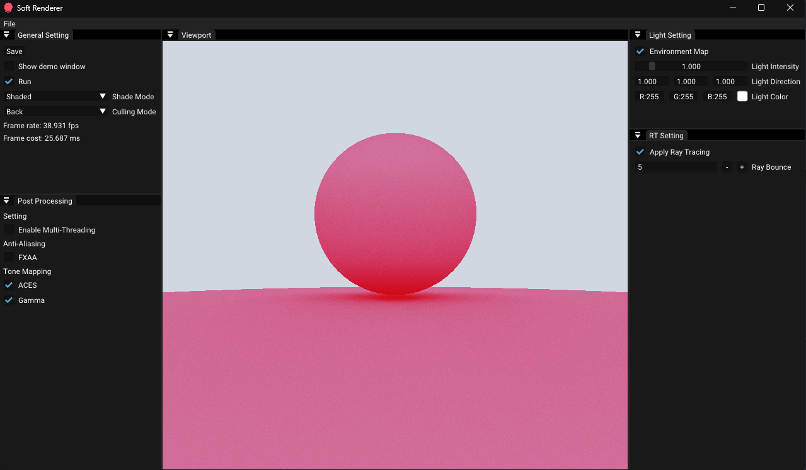
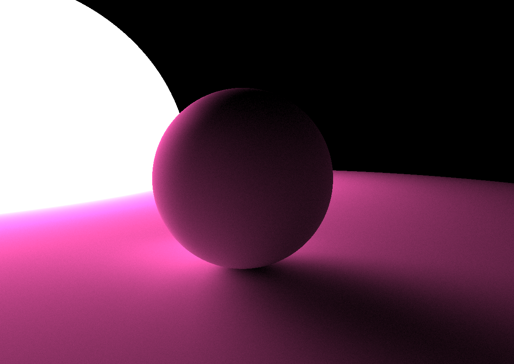

# Soft Renderer

## Render

- Whitted Raytracing
- Basic Path Tracing
- Phong Shading

## Geometry

- Triangle Mesh
- Sphere
- Quad

## Acceleration

- std::execution::par
- TBB parallel for
- embree3 for BVH ray intersection

## TODO

- oidn for noise reduce
- BDPT
- Disney BSDF
- Cook-Torrance BRDF
- ClearcoatedConductor

## Gallery

