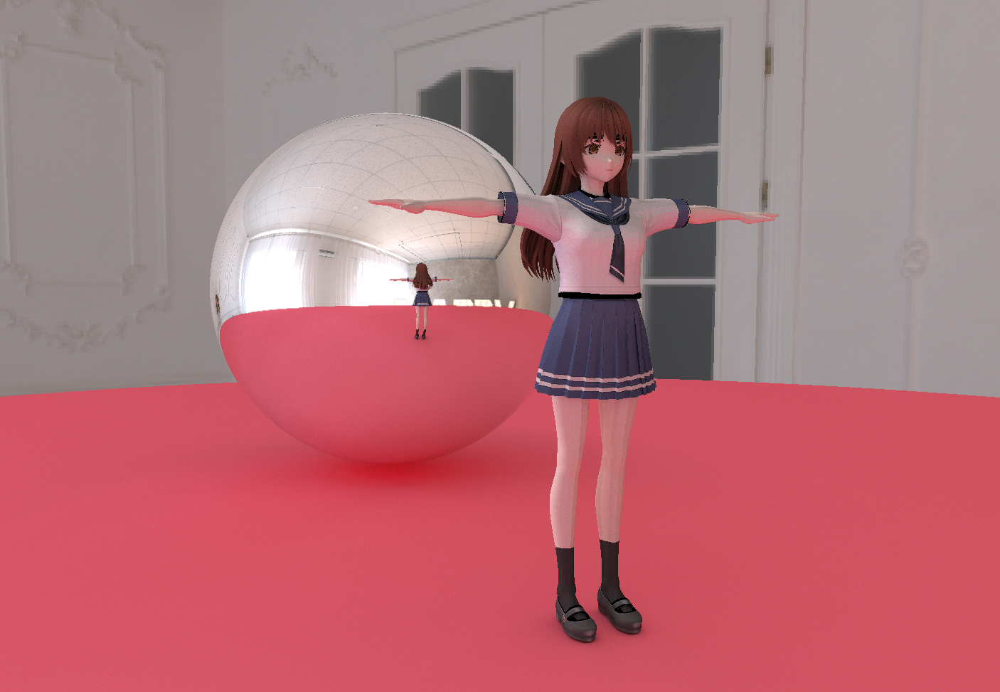

# Soft Renderer

## Render

### Rasterization

- Vertex Assembly
- Fragment Shading
- Z-Test

### Raytracing

- Whitted Raytracing
- Basic Path Tracing

## Geometry

- Triangle Mesh
- Sphere
- Quad

## Acceleration

- Multi-Threading
  - std::execution::par
  - TBB parallel for
  - OMP for

- BVH

## Denoising

- Temporal Filter
- oidn

## TODO

- BDPT
- Disney BSDF
- Cook-Torrance BRDF
- ClearcoatedConductor

## Gallery

