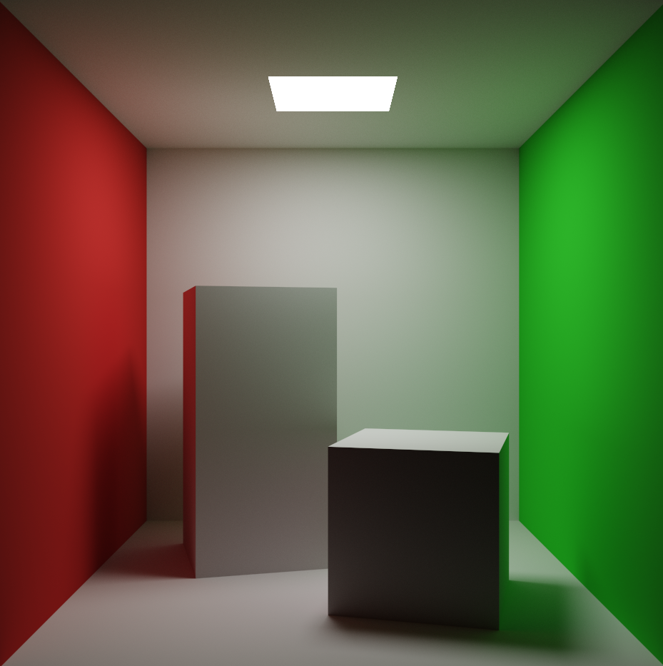
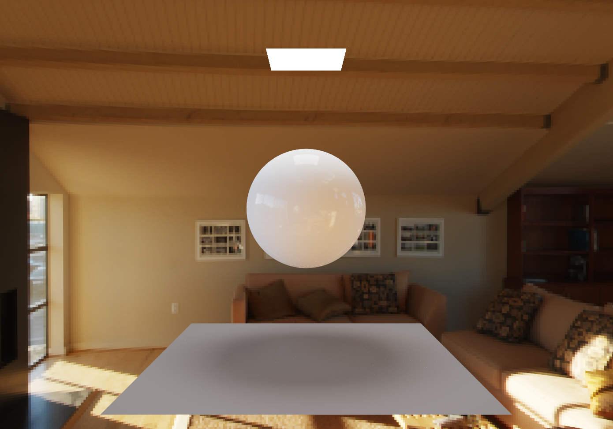

# Soft Renderer

## Render

### Rasterization

- Vertex Assembly
- Fragment Shading
- Z-Test

### Raytracing

- Path Tracing
- Cook-Torrance BRDF
- Importance Sampling

## Geometry

- Triangle Mesh
- Sphere

## Acceleration

- Multi-Threading
  - STL execution
  - TBB 
  - OMP

- BVH

## Denoising

- Temporal Filter
- oidn

## TODO

- MIS
- BDPT
- Disney BSDF
- ClearcoatedConductor

## Gallery

